# Exercise 14 - SQL Queries

## 1. Select PlayerNo and Name of players who’ve been born after 1960

### Statement

``` sql
SELECT PlayerNo, Name from Players
    WHERE year_of_birth > 1960;
```

### Result
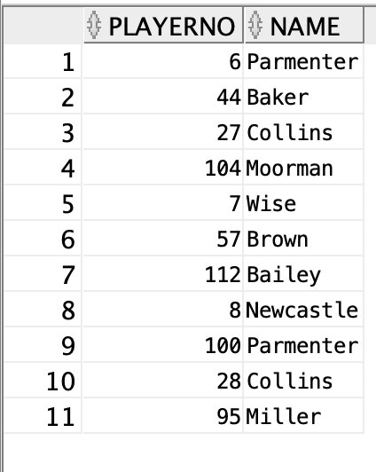

## 2. Select PlayerNo, Name and City of all female players who don’t live in Stratford

### Statement
```sql
SELECT PlayerNo, Name, TOWN FROM Players
    WHERE SEX = 'F' AND TOWN != 'Stratford';
```

### Result
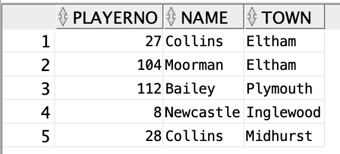

## 3. Select all PlayerNos of players who joined the club between 1970 and 1980

### Statement
```sql
SELECT PlayerNo FROM PLAYERS
    WHERE YEAR_JOINED > 1970 AND YEAR_JOINED < 1980;
```

### Result
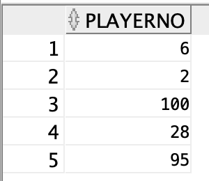

## 4. Select PlayerNo, Name and Year of birth of players who are born in a leap year

### Statement
```sql
SELECT PLAYERNO, NAME, YEAR_OF_BIRTH FROM PLAYERS
    WHERE MOD(YEAR_OF_BIRTH, 4) = 0 AND MOD(YEAR_OF_BIRTH, 100) != 0;
```

### Result
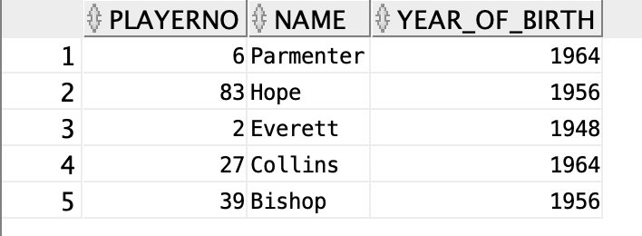

## 5. Select the PaymentNos of penalties between 50 and 100£

### Statement
```sql
SELECT PAYMENTNO FROM PENALTIES
    WHERE AMOUNT > 50 AND AMOUNT < 100;
```

### Result
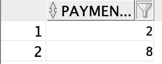

## 6. Select the PlayerNo and Name of players who don’t live in Stratford or Douglas

### Statement
```sql
SELECT PLAYERNO, NAME FROM PLAYERS
    WHERE TOWN != 'Stratford' OR TOWN != 'Douglas';

```

### Result
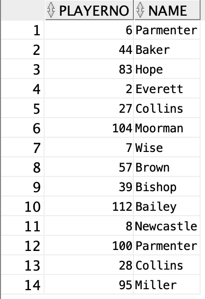

## 7. Select PlayerNo and Name of players whose name contains ’is’

### Statement
```sql
SELECT PLAYERNO, NAME FROM PLAYERS
    WHERE NAME LIKE '%is%';
```

### Result
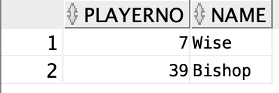

## 8. Select all players who are amateures

### Statement
```sql
SELECT * FROM PLAYERS 
    WHERE leagueno IS NULL;
```

### Result
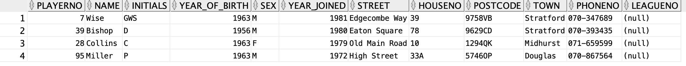

## 1. Select all employees who receive more provision than salary.

### Statement
```sql
SELECT * FROM EMP
    WHERE COMM > SAL;
```

### Result
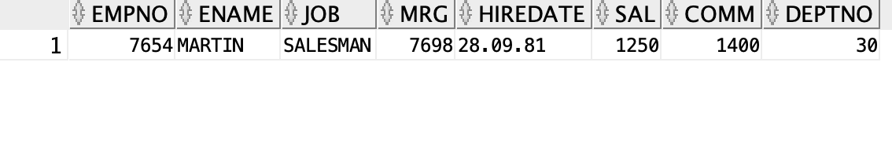

## 2. Select all employees of department 30.

### Statement
```sql
SELECT * FROM EMP
    WHERE DEPTNO = 30;
```

### Result
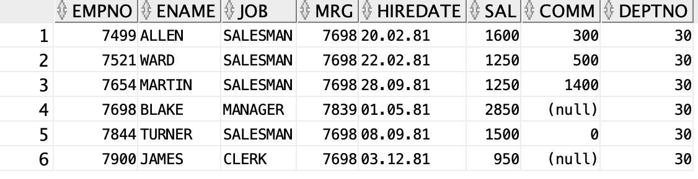

## 3. Select all employees of department 30 with a salary greater than 1500.

### Statement
```sql
SELECT * FROM EMP 
    WHERE DEPTNO = 30 AND SAL > 1500;
```

### Result
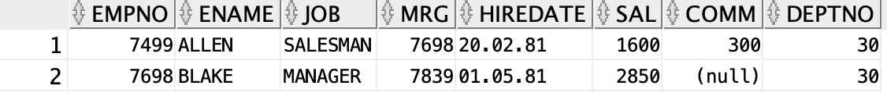

## 4. Select all employees of department 10 who are neither manager nor clerk.

### Statement
```sql
SELECT * FROM EMP 
    WHERE DEPTNO = 10 
    AND JOB != 'CLERK' 
    AND JOB != 'MANAGER';
```

### Result
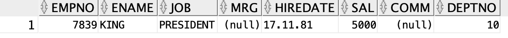

## 5. Select all employees with a salary between 1200 and 1300.

### Statement
```sql
SELECT * FROM EMP WHERE SAL > 1200 AND SAL < 1300;
```

### Result
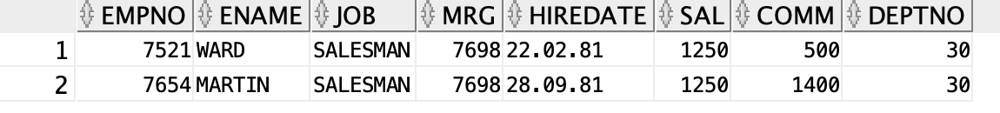

## 6. Select all employees whose name is 5 characters long and starts with ’ALL’.

### Statement
```sql
SELECT * FROM EMP 
    WHERE LENGTH(ENAME) = 5 AND ENAME LIKE 'ALL%';
```

### Result
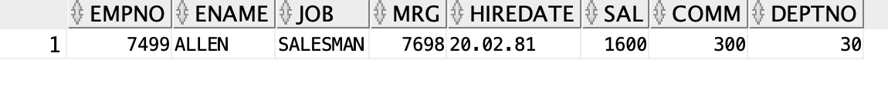

## 7. Select the total salary (base salary + provision) for all employees.

### Statement
```sql
SELECT SAL + NVL(COMM, 0) FROM EMP;
```

### Result
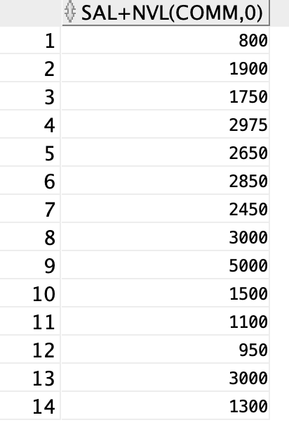

## 8. Select all employees whose provision is more than 25% of their salary.

### Statement
```sql
SELECT * FROM EMP WHERE COMM > SAL/4;
```

### Result
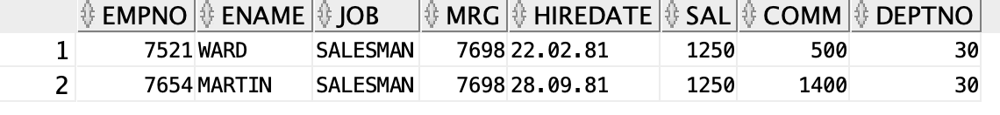

## 9. Select the average salary of all clerks.

### Statement
```sql
SELECT AVG(SAL) FROM EMP WHERE JOB = 'CLERK';
```

### Result
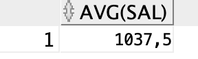

## 10. Select the number of employees who have received a provision.

### Statement
```sql
SELECT COUNT(JOB) NOCOMM FROM EMP WHERE COMM IS NOT NULL;
```

### Result
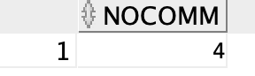

## 11. Select the number of different jobs in department 30.

### Statement
```sql
SELECT COUNT(DISTINCT JOB) FROM EMP WHERE DEPTNO = 30;
```

### Result
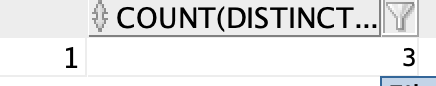

## 12. Select the employees who have been hired between 1981-01-04 and 1981-04-15.

### Statement
```sql
SELECT * FROM EMP
    WHERE HIREDATE
    BETWEEN TO_DATE('1981-01-04', 'YYYY-MM-DD') 
    AND TO_DATE('1981-04-15', 'YYYY-MM-DD');
```

### Result
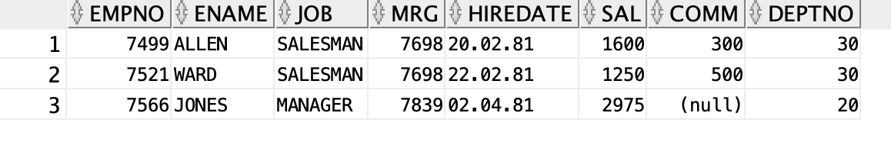


